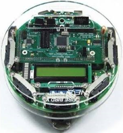

# Line-Following with Obstacle Avoidance

## 🔍 Description

This project is based on the **Fire Bird V ATMEGA2560 robot**, a microcontroller-based development platform designed at **IIT Bombay** under the **MHRD e-Yantra initiative**. Fire Bird V is the fifth robot in its series and follows an **open-source doctrine** in both hardware and software, ensuring compatibility with environments like **Keil**, **Matlab**, **Scilab**, and **LabVIEW**.

The robot uses:
- **ATmega2560** as the master controller
- **ATmega8** as the slave controller  
to control various sensors and actuators for tasks like **line following** and **obstacle detection**.

## ⚙️ Components Used

- **Microcontrollers**:
  - ATmega2560 (Master)
  - ATmega8 (Slave)
- **Sensors**:
  - 3 IR Proximity Sensors (Port F: 5, 6, 7)
  - 3 White Line Sensors (Port F: 1, 2, 3)
- **Actuators**:
  - Motors (controlled via L293D motor driver)
  - Buzzer
- **Displays**:
  - LCD Display
- **Others**:
  - SHARP IR sensor
  - Ni-MH Battery
  - LEDs

## 🧩 Interfacing Overview

The project is implemented using **Atmel Studio**, with direct register-level programming of the **ATmega2560** microcontroller.

### 📦 Register & Port Configuration

| Function                  | Register/Port Used     |
|--------------------------|------------------------|
| Motor Direction Control  | `DDRA`, `PORTA (0–3)`  |
| Motor PWM Control        | `PORTL (3, 4)`, `OCR5A`, `OCR5B` |
| Line Sensor Inputs       | `PORTF (1, 2, 3)`       |
| IR Sensor Inputs         | `PORTF (5, 6, 7)`       |
| ADC Configuration        | `ADMUX`, `ADCSRA`, `ADCSRB` |
| Timer for PWM            | `TCCR5A`, `TCCR5B`      |

### 🧠 Main Code

The core logic for line following and obstacle avoidance is implemented in the following main file:

| File Path                              | Description                                      |
|----------------------------------------|--------------------------------------------------|
| `Fire_bird_project/Fire_bird_project/main.c` | Main program controlling robot behavior — including line following, IR sensing, motor control via PWM, and decision-making logic based on sensor data. |

This file:
- Initializes ports, ADC, timers, and LCD.
- Reads input from IR and line sensors.
- Uses PWM to control motor direction and speed.
- Contains the FSM logic (`process()`) to switch between line-following and obstacle-avoidance behavior.

Additional helper functions like `fwd()`, `fwd_left()`, `stop()`, and `ADC_Conversion()` are defined here for modularity and clarity.

## 📚 References

- [Fire Bird V ATMEGA2560 Hardware Manual](docs/Fire%20Bird%20V%20ATMEGA2560%20Hardware%20Manual%20V1.08%202012-10-12.pdf)
- [Fire Bird V MK2LPC2148 Software Manual](docs/Fire%20Bird%20V%20MK2LPC2148%20Software%20Manual%20V1.10%20Sachit%202013-05-05.pdf)
- [e-Yantra Final Report (2018–19)](docs/report/eyantra%20final%20report.pdf)

## 🧩 Unit Codes

The project includes modular unit codes organized by microcontroller platform for better structure and maintainability.

### 🔧 ATmega2560

| Unit   | Path                             | Description                    |
|--------|----------------------------------|--------------------------------|
| LCD    | `atmega2560/LCD/main.c`          | Controls the LCD display       |
| Buzzer | `atmega2560/Buzzer/main.c`       | Buzzer control and alerts      |
| UART   | `atmega2560/uart/main.c`         | UART communication interface   |

### 🔧 LPC2148

| Unit   | Path                             | Description                    |
|--------|----------------------------------|--------------------------------|
| Buzzer | `LPC2148/Buzzer/main.c`          | Buzzer control on LPC2148      |

## 🧑‍💻 Authors

This project was developed as part of the **e-Yantra Summer Internship Program at IIT Bombay** (2018–19), under the theme: _Different Line Following Path with Object Sensing_.

- **Sahil Rajpurkar** (1613130) 
- **Shrey Shah** (1613042)  
- **Surya Maheswar** (1613048)  

## 📜 Attribution

This project is an **educational open-source** project developed under the **e-Yantra Internship Program by IIT Bombay**, sponsored by the **MHRD, Government of India**.

